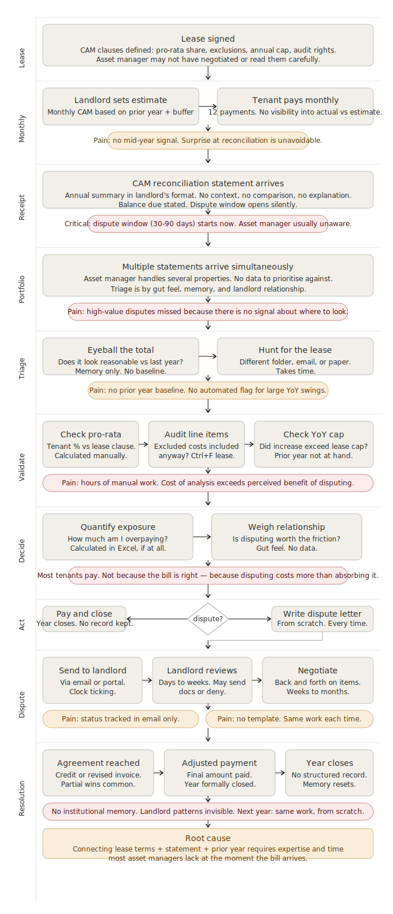

# CAM-Reconciliation-Intelligence

A system that provides users with valuable insights on their CAM reconciliation that allows them to make better decisions
Submission by Daniel Lester on June 8th 2026
Application URL: https://danieljlester.github.io/CAM-Reconciliation-Intelligence/

---

## Problem framing

**What problem I chose to solve**

- Asset managers receive CAM reconciliation statements requesting additional payment.
- Validating whether those charges are correct takes days of work, requiring cross-referencing a lease and a financial statement, then doing detailed calculations that typically involve finance or legal. 
- They typically have a short dispute window of 30 to 90 days.
- With multiple properties to manage simultaneously, there aren't enough resources and time to analyse all the statements, so the asset manager relies on "gut-feel", memory and relationships, to make a decision which statements to analyse, and which to just pay.
- Money stays on the table not because asset managers don't care, but because the cost of analysis exceeds the perceived benefit.

**The behavioral mechanism**

- The product removes the cost of analysis (human resources and time) 
- When the analysis takes days a reasonable shortcut is to pay the bill. But when this becomes minutes, with no human resources involved, that shift in economics is what drives the behavioral change

## **What I assumed**
- The asset manager has the landlord relationship and the decision authority.
- Finance and legal are resources they can call on, not the people doing the day-to-day review.
- The dispute window is real, shorter than feasible to run reviews across multiple properties and hidden within the lease documents, so the tenant is not aware at the point the statement arrives.
- Most tenants have prior year figures available but not connected to the current statement. That connection is currently manual.

**What I deliberately ignored**

- Portfolio-level rollup: The single property analysis has to work first and gain user adoption before expanding to multiple tenancies or portfolio-level. Portfolio has real value give a holistic view and focus the users time in highest value properties. However, it comes with separate problems with scaling (performance, UX changes, regional differences, architecture)
- Shipping a wide product that doesn't solve the primary problem well is worse than shipping a narrow product that does.
- Landlord-side workflow - This is a different flow, as noted above.
- Legal review integration. The product builds the case, but ultimately the asset manager has to bring it to their inhouse counsel and make a decision.
- Document storage and management - Not part of the core problem
- Backend parsing pipelines - the prototype focuses on the experience, behavior and decisions
- No admin, email or integrations - Email integration requires trust, which is only built after regular use. Admin settings is only required for a production level multi-user/tenant software.
- Historical benchmarking - prototype assumes this is the first time use and has no history, nor expects the user to dig through years of old files in order to use the software.

---

## 2. Product thinking

**Target user**

- Tenant side Asset Manager in real estate division of a company, like CVS. I decided that tenant side has more to gain with a CAM Intelligence product, allowing better decisions and saving time and money, while the owner side has less behavioral surface, and is oriented in data structuring.

**Persona:** Not a finance analyst. Not legal. The asset manager owns the landlord relationship and has the authority to dispute. They need to know whether to act, not how to read a lease clause. They are relationship-driven, not software-native. Most of their work runs through Microsoft Office and their phone.

**Depth over breadth** System is only for a single user and the analysis is carried out one property at a time. One decision per review. The portfolio layer and the historical benchmarking are real opportunities but they require this core loop to work first. 

**Core user flow**

Upload documents (CAM statement + lease) → system reads and extracts key figures → user confirms the data → analysis runs automatically, cross-referencing charges against lease terms → flagged issues surface with plain-language explanations, dollar impact, and confidence levels → asset manager decides whether to act → dispute letter pre-drafted and ready to edit → outcome logged when resolved.

The system is assistive, not fully automated. The users want to be able to make decisions themselves, using other factors such as relationship which the system won't handle on day.

Inputs are the base documents available, but the user has the ability to input further information if they want or have it available. It is not considered mandatory.

**Where the moment of value is**

The transition from "I have a document" to "I know whether this is worth disputing and what my position is." That transition currently takes hours or days and requires expertise most asset managers don't have on hand at the moment the bill arrives. The product makes it take minutes and requires no prior knowledge of the lease.

**What makes this better than current workflow**

The lease and the statement have always existed. The problem was that connecting them required expertise and time that most asset managers don't have at the moment the bill arrives. The product does that triangulation automatically and surfaces only the things that warrant attention, with enough explanation that the asset manager can make a decision without needing a lawyer in the room.

Specific improvements over current workflow:
- Dispute window surfaced immediately on receipt, not discovered after it has already closed
- Lease terms and statement figures connected automatically, no ctrl+F or separate Excel calculation
- Dollar impact quantified before the decision, not after
- Dispute letter pre-drafted, reducing the friction of acting to near zero
- Each review recorded, building institutional memory that currently lives in email or nowhere

**How confidence, trust, and explainability are handled**

Every flagged issue shows the specific lease clause it references, the underlying calculation, and a plain-English explanation of the reasoning. Confidence levels are labeled in plain language: "strong basis to dispute" and "needs more information," not technical scores. Issues with insufficient evidence are included in the analysis but excluded from the dispute letter by default, with an explanation of why. The product never tells the asset manager what to do. It presents the case. They decide.

---

## 3. Experience

Visibility and Clarity - The system provides clarity to new user with full explanation on first page, and guided steps at the top, showing the user where they are now, and where they are going.

**Moments**
*Raw data > Insight > Action*

*Orient.* The review summary screen shows what the system extracted from the documents: key lease terms, billed amounts, prior year comparison, and the dispute deadline. The user confirms the data is correct before the analysis runs. This builds trust in the output and catches extraction errors before they affect the analysis.

*Flag.* The analysis screen surfaces issues in plain English, ranked by dollar impact. Each issue expands to show the lease clause, the calculation, and the confidence reasoning. The speculative item is included but visually distinct, with a clear explanation of why it has been separated from the high-confidence items.

*Arm.* The dispute letter is pre-drafted with financial figures and clause references already populated. It is editable. The asset manager owns the final content. Clicking "Mark as sent" moves the tenancy to the dispute tracking stage, and the outcome is logged when resolved.

---

## 4. Prototype

The prototype covers the full flow across seven screens: login, home with saved tenancies, document upload with validation, review summary, analysis loading state, analysis with expandable issue cards, dispute letter with editable content and download, and outcome logging.

---

## 5. Tradeoffs

### What I simplified**

- Single property. The home screen shows saved tenancies, but the analysis flow covers one property at a time. 
- Mock input and output data, no user upload function. Real document parsing is a hard, separate engineering problem. The prototype assumes the analysis pipeline has been sufficiently developed, at least at a limited level.
- The technical depth is excluded from this assignment, in order to focus on the experience and behavioural change, as this is a product thinking assignment, not an engineering assignment. Nevertheless the analysis is core to the product, and shouldn't have workarounds, although first versions would likely only solve a specific set of cases.
- If I was to build it, it would be pipeline use an LLM for it's natural language processing, and a separate dynamic mathematical computation method. It would include supervised learning data models for context and expected results and evaluations.

### Where this would break in real-world usage**

- Non-standard CAM statement formats. Landlords structure these differently. Reliable extraction across formats requires significant engineering investment and ongoing maintenance.
- Ambiguous lease language. "Reasonable management fees" is not a number. The product can flag it but cannot calculate a precise overcharge without human judgment.
- Multi-tenant properties with complex pro-rata structures. These require the full rent roll, not just one tenant's lease.
- Leases with addenda or side letters that override base terms. A document parser that reads the base lease and misses an addendum produces a confident wrong answer.

### What I would build next**
*Order does not reflect prioritization, the priority would be the result of business value, user feedback and effort*

1. **Portfolio dashboard view** - ability to roll-up the single reports per location or owner, surfacing the highest value and highest dispute confidence properties. This compiles and enhances the prototypes offering, removing the remaining "gut feel" decision still.

2. **Integrations** - Integrating with emails, file storage to streamline the process, reducing the cognitive load on tracking and preparations.

3. **Landlord pattern tracking** if a landlord has had management fee overcharges flagged across three properties over two years, that is signal worth surfacing. The data to support this exists after a few cycles of use.

4. **Discrepancy vs risk to relationship** - Discrepancy limit - user can set a range that is an acceptable discrepancy to pay, between total CAM payments and reconciliation, per owner, where a small discrepancy is not worth disputing to risk the relationship. It lowers the amount of disputes surfaced for the user to peruse, for a less overwhelming experience.

5. **CAM Reconciliation Budget** - Assumption: a good asset manager will include a CAM reconcilation amount in a budget. The product uses the historical feature to feed an annual budget insight. The budget would be included as a function to support making the end of year reconciliation decisions. For example, if the total reconciliation/net weighted difference is 10% more/less than the budget, ignore and pay.

6. **Tracking throughout the year** - The prototype focuses on the short time window when the CAM reconciliation reports are received. This makes the product's usage seasonal, but CAM related updates throughout the year could be incorporated, connecting the product to the real estate owner themselves, so that the reconciliation is more robust, and less of surprise. Connecting to the owner broadens the products exposure, and lets the owner know they need to be more robust in their reconcilliations, and REAL is the solution!
